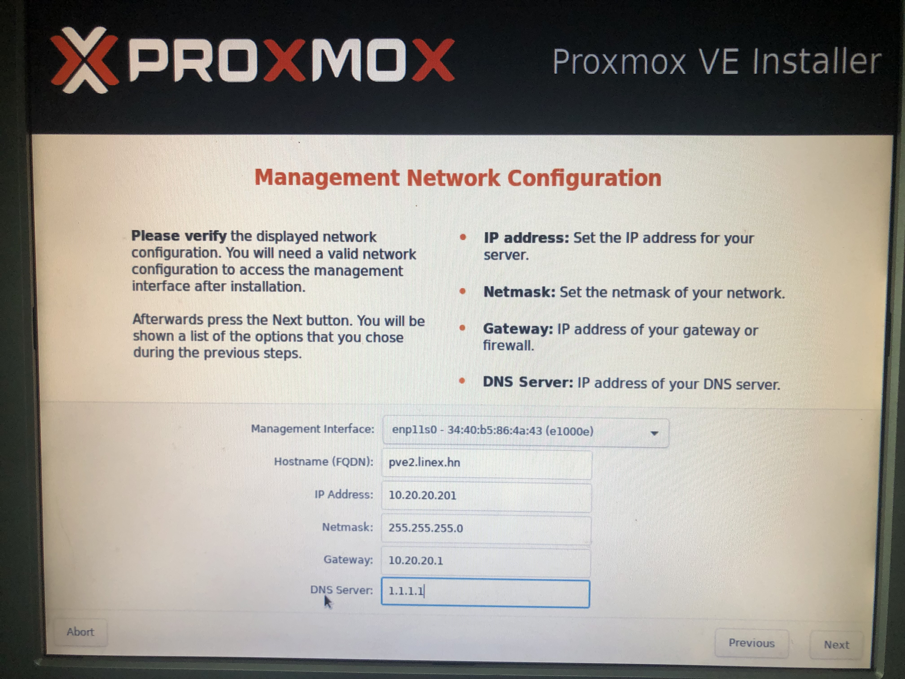

# Hướng dẫn cài đặt os Proxmox

## 1. Tạo USB Boot 

* Link download: [Proxmox VE 6.2 ISO Installer](https://www.proxmox.com/en/downloads/item/proxmox-ve-6-2-iso-installer)

* Tạo usb boot trên Mac: dd if=/Volumes/Data/ngocbob/Downloads/proxmox-ve_6.2-1.iso of=/dev/rdisk2 bs=8k
* Tạo usb boot trên Window: [balenaEtcher - Flash OS images to SD cards & USB drives](https://www.balena.io/etcher/)

## 2. Cài đặt Proxmox

Cắm usb boot vào máy chủ và khởi động máy chủ chọn boot từ usb.
Giao diện cài đặt sau khi boot vào usb. Chọn ```Install Proxmox VE```


Chọn ```I agree```


Chọn ```Options```


Tại đây lựa chọn các thông số như sau:
  - Filesystem: ```zfs (RAID0)```
  - Harddisk 0: ```/dev/sda (279GB, ...)```
  - Harddisk 1: ```do not use```
  - Harddisk 2: ```do not use```
  - OK


Chọn ```Next``` để tiếp tục


Location và Time zone chọn như hình dưới, chọn ```Next``` để tiếp tục


Đặt Password cho tài khoản ```root``` khi login vào máy chủ Proxmox, điền email. Chọn ```Next``` để tiếp tục


Phần cấu hình Network cho máy chủ cấu hình như sau:
  - Management Interface: máy chủ sẽ có 4 card mạng, ta chọn 1 trong 4 card bất kỳ đều được. Ở đây ta chọn card mạng có tên ```enpenplls0 - 34:40:b5:86:4a:43 (e1000e)```
  - Hostname (FQDN): ```pve1.vvg.vn```
  - IP Address: ```10.248.189.241```
  - Netmask: ```255.255.255.0```
  - Gateway: ```10.248.189.254```
  - DNS Server: ```1.1.1.1```
Chọn ```Next```



Chọn ```Install``` để tiến hành cài đặt


Giao diện Proxmox đang tiến hành cài đặt:


Sau khi Proxmox được cài đặt xong, chọn ```Reboot``` để khởi động lại máy chủ.
Để truy cập proxmox trên giao diện web gõ địa chỉ ip đã đặt kèm port như thông báo trong hình bên dưới:
https://10.248.189.241:8006


## 3. Cài đặt Cluster proxmox

Mô tả: 
         pve1: 10.248.189.241 -> Cluster master
         pve2: 10.248.189.242 -> Join cluster pve1
         pve3: 10.248.189.243 -> Join cluster pve1
         pve4: 10.248.189.244 -> Join cluster pve1

         
Tạo cluster trên pve1, từ pve2 và pve3 join vào cluster đã tạo trên pve1

###  Thực hiện trên cả 3 node

  - Ping 10.248.189.241-> Kiểm tra pve1 đã thông với pve2, pve3
  - Nano /etc/hosts -> Thêm địa chỉ ip vào file host

Sua file pve subcription

```
vim /etc/apt/sources.list.d/pve-enterprise.list

#deb https://enterprise.proxmox.com/debian/pve buster pve-enterprise
deb http://download.proxmox.com/debian buster pve-no-subscription
```

  ```
  apt-get update
  apt-get install ifupdown2
  apt-get install net-tools
  ```
  
  ```
    $ vim etc/hosts
  
    10.248.189.241 pve1.vvg.vn pve1
    10.248.189.242 pve2.vvg.vn pve2
    10.248.189.243 pve3.vvg.vn pve3
    10.248.189.244 pve4.vvg.vn pve4
 
 ``` 
 
* Ping domain kiểm tra xem ping đã thông
    
 
    $ ping pve2
    $ ping pve3
    $ ping pve1
    

### Thực hiện trên pve1
 
* Tạo cluster cú pháp: pve create [tên_cluster]

Ví dụ:
 
 ```
  pvecm create clusterpve
 
 ```
 
* Kiểm tra trạng thái cluser
 
 ``` 
  pvecm status
 ```

 **Trường hợp tạo lỗi cần phải xoá Cluster sử dụng câu lệnh dưới đây:
 DELETE CLUSTER: Xoá Cluster**

```
systemctl stop pve-cluster corosync

pmxcfs -l

rm -r /etc/corosync/*

rm /etc/pve/corosync.conf

killall pmxcfs

systemctl start pve-cluster


Những máy đã từng join cluster sẽ có thông tin tại: /etc/pve/nodes/

ls -la /etc/pve/nodes/

cd /etc/pve/nodes/

Xoá file lưu dữ liệu nodes đã có (tren tat cac may). Tiếp tục tạo cluster và join lại.

rm -rf pve2
rm -rf pve3

```

### Thực hiện trên pve2


 * Join vào cluster *clusterpve* đã tạo trên pve1 bằng cú pháp:  pvecm add IP-ADDRESS-CLUSTER

IP-ADDRESS-CLUSTER: IP của pve1 đã tạo cluster

```

pvecm add 10.248.189.241

```

### Cấu hình trên pve3

```
 pvecm add 10.248.189.241
 
```