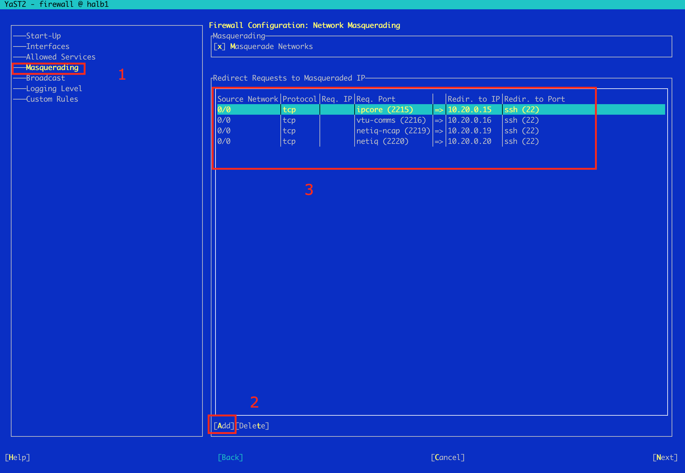

## 10. Hướng dẫn kết nối kiểm tra HAPROXY - Loadbanlancer


Kết nối ssh vào các máy Load Balancer
Trong cấu hình demo
LB1 địa chỉ là `10.248.189.101`
LB2 là `10.248.189.102`
User: `root`
default password: `vvg@2020`

```shell
$ ssh root@10.248.189.101
Password: 
Last login: Fri Nov  6 10:56:24 2020 from 10.20.0.18
===============================================================================
       SNAPT CONSOLE ACCESS

        Setup Network   : networkConfig
        Get IP Address  : getipaddress
        Default Root PW : snapt
        Default UI Port : 8080
===============================================================================
        To start use a  web browser  to go to port 8080
        Type  getipaddress  to find the IP,
        or  networkConfig  to set it.
```

## Haproxy

```

SNAPT root@halb1 ~ # cat /etc/haproxy/haproxy.cfg


global
log 127.0.0.1:29987 local0
maxconn 40960
daemon
stats socket /var/run/haproxy.socket mode 777 level admin
ssl-server-verify required
ssl-dh-param-file /etc/haproxy/dhparams.pem
ssl-default-bind-options no-sslv3
ssl-default-bind-ciphers AES128+EECDH:AES128+EDH


defaults
log global
mode http
option dontlognull
retries 2
option redispatch
maxconn 2000
timeout connect 5000
timeout client 60000
timeout server 120000
option http-server-close


listen admin_page
bind *:9600
mode http
stats enable
stats refresh 60s
stats uri /
stats auth admin:UiB9cP0SDVznSw


listen backend_viettel_8100
bind 0.0.0.0:8100
balance leastconn
maxconn 4000
mode tcp
timeout tunnel 3600000
server ep1_8100 10.254.226.1:8100 check fall 3 rise 15 inter 3000 maxconn 1000 weight 20
server ep2_8100 10.254.226.2:8100 backup check fall 3 rise 15 inter 3000 maxconn 1000 weight 20


listen etcproc_boo2_999
bind 0.0.0.0:999
balance leastconn
maxconn 4000
mode tcp
timeout tunnel 86400000
server ap1_15 10.20.0.15:999 check fall 3 rise 15 inter 3000 maxconn 1000 weight 20
server ap2_16 10.20.0.16:999 backup check fall 3 rise 15 inter 3000 maxconn 1000 weight 20


listen lb_database_3306
bind 0.0.0.0:3306
balance leastconn
maxconn 400
mode tcp
server db1_19 10.20.0.19:3306 check fall 3 rise 15 inter 2000 maxconn 200 weight 20
server db2_20 10.20.0.20:3306 backup check fall 3 rise 15 inter 2000 maxconn 200 weight 20


frontend public_ssl_all
bind 0.0.0.0:80
bind 0.0.0.0:443 ssl crt-list /etc/haproxy/certs.list
mode http
maxconn 4000
reqadd X-Forwarded-Proto:\ https
rspidel Set-cookie:\ IP=
rspidel Server:
rspidel X-Powered-By:
rspadd Server:\ LiNEX-LB8
option forwardfor except 127.0.0.0/24
rspirep ^(set-cookie:.*) \1;\ SameSite=None
acl forwarded_https req.hdr(X-Forwarded-Proto) -i https
acl dom_boo2_vn hdr_dom(host) -i boo2.vn
acl host_admin-5030_boo2_vn hdr_dom(host) -i admin-5030.boo2.vn
acl host_mtc-5030_boo2_vn hdr_dom(host) -i mtc-5030.boo2.vn
acl host_gateway-5030_boo2_vn hdr_dom(host) -i gateway-5030.boo2.vn
acl host_gate-5030_boo2_vn hdr_dom(host) -i gate-5030.boo2.vn
acl host_oauth-5030_boo2_vn hdr_dom(host) -i oauth-5030.boo2.vn
acl host_terminal-5030_boo2_vn hdr_dom(host) -i terminal-5030.boo2.vn
acl host_anpr-5030_boo2_vn hdr_dom(host) -i anpr-5030.boo2.vn
acl host_edge-5030_boo2_vn hdr_dom(host) -i edge-5030.boo2.vn
redirect scheme https if dom_boo2_vn !{ ssl_fc }
use_backend admin_boo2_aps_8443 if host_admin-5030_boo2_vn
use_backend billing_boo2_aps_6666 if host_mtc-5030_boo2_vn
use_backend anpr_boo2_aps_6667 if host_anpr-5030_boo2_vn
use_backend gate_boo2_aps_8111 if host_gate-5030_boo2_vn
use_backend oauth_boo2_aps_8181 if host_oauth-5030_boo2_vn
use_backend terminal_boo2_aps_8686 if host_terminal-5030_boo2_vn
use_backend gateway_boo2_aps_8866 if host_gateway-5030_boo2_vn
use_backend edge_boo2_aps_9999 if host_edge-5030_boo2_vn
#default_backend admin_boo2_aps


backend admin_boo2_aps_8443
mode http
option httpchk HEAD /
http-check expect rstatus ^(20|30|40)
option http-server-close
option forwardfor except 127.0.0.0/24
#reqidel X-Frame-Options
option abortonclose
cookie SVID indirect insert nocache
server ap1_15 10.20.0.15:8443 cookie ap1 check fall 3 rise 15 inter 3000 maxconn 248 weight 10 ssl verify none
server ap2_16 10.20.0.16:8443 cookie ap2 backup check fall 3 rise 15 inter 3000 maxconn 248 weight 10 ssl verify none


backend anpr_boo2_aps_6667
mode http
option httpchk HEAD /
http-check expect rstatus ^(20|30|40)
option http-server-close
option forwardfor except 127.0.0.0/24
#reqidel X-Frame-Options
option abortonclose
cookie SVID indirect insert nocache
server anp1_22 10.20.0.22:6667 cookie anpr1 check fall 3 rise 15 inter 3000 maxconn 248 weight 10
server anp2_24 10.20.0.24:6667 cookie anpr2 backup check fall 3 rise 15 inter 3000 maxconn 248 weight 10


backend billing_boo2_aps_6666
mode http
option httpchk HEAD /
http-check expect rstatus ^(20|30|40)
option http-server-close
option forwardfor except 127.0.0.0/24
#reqidel X-Frame-Options
option abortonclose
cookie SVID indirect insert nocache
server ap1_15 10.20.0.15:6666 cookie ap1 check fall 3 rise 15 inter 3000 maxconn 248 weight 10 ssl verify none
server ap2_16 10.20.0.16:6666 cookie ap2 backup check fall 3 rise 15 inter 3000 maxconn 248 weight 10 ssl verify none


backend edge_boo2_aps_9999
mode http
option httpchk HEAD /
http-check expect rstatus ^(20|30|40)
#option http-server-close
option forwardfor except 127.0.0.0/24
#reqidel X-Frame-Options
option abortonclose
cookie SVID indirect insert nocache
server ap1_15 10.20.0.15:9999 cookie ap1 check fall 3 rise 15 inter 3000 maxconn 248 weight 10
server ap2_16 10.20.0.16:9999 cookie ap2 backup check fall 3 rise 15 inter 3000 maxconn 248 weight 10


backend gate_boo2_aps_8111
mode http
option httpchk HEAD /
http-check expect rstatus ^(20|30|40)
option http-server-close
option forwardfor except 127.0.0.0/24
#reqidel X-Frame-Options
option abortonclose
cookie SVID indirect insert nocache
server ap1_15 10.20.0.15:8111 cookie ap1 check fall 3 rise 15 inter 3000 maxconn 248 weight 10 ssl verify none
server ap2_16 10.20.0.16:8111 cookie ap2 backup check fall 3 rise 15 inter 3000 maxconn 248 weight 10 ssl verify none


backend gateway_boo2_aps_8866
mode http
option httpchk HEAD /
http-check expect rstatus ^(20|30|40)
option http-server-close
option forwardfor except 127.0.0.0/24
#reqidel X-Frame-Options
option abortonclose
cookie SVID indirect insert nocache
server ap1_15 10.20.0.15:8866 cookie ap1 check fall 3 rise 15 inter 3000 maxconn 248 weight 10
server ap2_16 10.20.0.16:8866 cookie ap2 backup check fall 3 rise 15 inter 3000 maxconn 248 weight 10


backend oauth_boo2_aps_8181
mode http
option httpchk HEAD /
http-check expect rstatus ^(20|30|40)
option http-server-close
option forwardfor except 127.0.0.0/24
#reqidel X-Frame-Options
option abortonclose
cookie SVID indirect insert nocache
server ap1_15 10.20.0.15:8181 cookie ap1 check fall 3 rise 15 inter 3000 maxconn 248 weight 10
server ap2_16 10.20.0.16:8181 cookie ap2 backup check fall 3 rise 15 inter 3000 maxconn 248 weight 10


backend terminal_boo2_aps_8686
mode http
option httpchk HEAD /
http-check expect rstatus ^(20|30|40)
option http-server-close
option forwardfor except 127.0.0.0/24
#reqidel X-Frame-Options
option abortonclose
cookie SVID indirect insert nocache
server ap1_15 10.20.0.15:8686 cookie ap1 check fall 3 rise 15 inter 3000 maxconn 248 weight 10
server ap2_16 10.20.0.16:8686 cookie ap2 backup check fall 3 rise 15 inter 3000 maxconn 248 weight 10
SNAPT root@halb1 ~ #
```

```

SNAPT root@halb2 ~ # cat /etc/haproxy/haproxy.cfg


global
log 127.0.0.1:29987 local0
maxconn 40960
daemon
stats socket /var/run/haproxy.socket mode 777 level admin
ssl-server-verify required
ssl-dh-param-file /etc/haproxy/dhparams.pem
ssl-default-bind-options no-sslv3
ssl-default-bind-ciphers AES128+EECDH:AES128+EDH


defaults
log global
mode http
option dontlognull
retries 2
option redispatch
maxconn 2000
timeout connect 5000
timeout client 60000
timeout server 120000
option http-server-close


listen admin_page
bind *:9600
mode http
stats enable
stats refresh 60s
stats uri /
stats auth admin:UiB9cP0SDVznSw


listen backend_viettel_8100
bind 0.0.0.0:8100
balance leastconn
maxconn 4000
mode tcp
timeout tunnel 3600000
server ep1_8100 10.254.226.1:8100 check fall 3 rise 15 inter 3000 maxconn 1000 weight 20
server ep2_8100 10.254.226.2:8100 backup check fall 3 rise 15 inter 3000 maxconn 1000 weight 20


listen etcproc_boo2_999
bind 0.0.0.0:999
balance leastconn
maxconn 4000
mode tcp
timeout tunnel 86400000
server ap1_15 10.20.0.15:999 check fall 3 rise 15 inter 3000 maxconn 1000 weight 20
server ap2_16 10.20.0.16:999 backup check fall 3 rise 15 inter 3000 maxconn 1000 weight 20


listen lb_database_3306
bind 0.0.0.0:3306
balance leastconn
maxconn 400
mode tcp
server db1_19 10.20.0.19:3306 check fall 3 rise 15 inter 2000 maxconn 200 weight 20
server db2_20 10.20.0.20:3306 backup check fall 3 rise 15 inter 2000 maxconn 200 weight 20


frontend public_ssl_all
bind 0.0.0.0:80
bind 0.0.0.0:443 ssl crt-list /etc/haproxy/certs.list
mode http
maxconn 4000
reqadd X-Forwarded-Proto:\ https
rspidel Set-cookie:\ IP=
rspidel Server:
rspidel X-Powered-By:
rspadd Server:\ LiNEX-LB8
option forwardfor except 127.0.0.0/24
rspirep ^(set-cookie:.*) \1;\ SameSite=None
acl forwarded_https req.hdr(X-Forwarded-Proto) -i https
acl dom_boo2_vn hdr_dom(host) -i boo2.vn
acl host_admin-5030_boo2_vn hdr_dom(host) -i admin-5030.boo2.vn
acl host_mtc-5030_boo2_vn hdr_dom(host) -i mtc-5030.boo2.vn
acl host_gateway-5030_boo2_vn hdr_dom(host) -i gateway-5030.boo2.vn
acl host_gate-5030_boo2_vn hdr_dom(host) -i gate-5030.boo2.vn
acl host_oauth-5030_boo2_vn hdr_dom(host) -i oauth-5030.boo2.vn
acl host_terminal-5030_boo2_vn hdr_dom(host) -i terminal-5030.boo2.vn
acl host_anpr-5030_boo2_vn hdr_dom(host) -i anpr-5030.boo2.vn
acl host_edge-5030_boo2_vn hdr_dom(host) -i edge-5030.boo2.vn
redirect scheme https if dom_boo2_vn !{ ssl_fc }
use_backend admin_boo2_aps_8443 if host_admin-5030_boo2_vn
use_backend billing_boo2_aps_6666 if host_mtc-5030_boo2_vn
use_backend anpr_boo2_aps_6667 if host_anpr-5030_boo2_vn
use_backend gate_boo2_aps_8111 if host_gate-5030_boo2_vn
use_backend oauth_boo2_aps_8181 if host_oauth-5030_boo2_vn
use_backend terminal_boo2_aps_8686 if host_terminal-5030_boo2_vn
use_backend gateway_boo2_aps_8866 if host_gateway-5030_boo2_vn
use_backend edge_boo2_aps_9999 if host_edge-5030_boo2_vn
#default_backend admin_boo2_aps


backend admin_boo2_aps_8443
mode http
option httpchk HEAD /
http-check expect rstatus ^(20|30|40)
option http-server-close
option forwardfor except 127.0.0.0/24
#reqidel X-Frame-Options
option abortonclose
cookie SVID indirect insert nocache
server ap1_15 10.20.0.15:8443 cookie ap1 check fall 3 rise 15 inter 3000 maxconn 248 weight 10 ssl verify none
server ap2_16 10.20.0.16:8443 cookie ap2 backup check fall 3 rise 15 inter 3000 maxconn 248 weight 10 ssl verify none


backend anpr_boo2_aps_6667
mode http
option httpchk HEAD /
http-check expect rstatus ^(20|30|40)
option http-server-close
option forwardfor except 127.0.0.0/24
#reqidel X-Frame-Options
option abortonclose
cookie SVID indirect insert nocache
server anp1_22 10.20.0.22:6667 cookie anpr1 check fall 3 rise 15 inter 3000 maxconn 248 weight 10
server anp2_24 10.20.0.24:6667 cookie anpr2 backup check fall 3 rise 15 inter 3000 maxconn 248 weight 10


backend billing_boo2_aps_6666
mode http
option httpchk HEAD /
http-check expect rstatus ^(20|30|40)
option http-server-close
option forwardfor except 127.0.0.0/24
#reqidel X-Frame-Options
option abortonclose
cookie SVID indirect insert nocache
server ap1_15 10.20.0.15:6666 cookie ap1 check fall 3 rise 15 inter 3000 maxconn 248 weight 10 ssl verify none
server ap2_16 10.20.0.16:6666 cookie ap2 backup check fall 3 rise 15 inter 3000 maxconn 248 weight 10 ssl verify none


backend edge_boo2_aps_9999
mode http
option httpchk HEAD /
http-check expect rstatus ^(20|30|40)
#option http-server-close
option forwardfor except 127.0.0.0/24
#reqidel X-Frame-Options
option abortonclose
cookie SVID indirect insert nocache
server ap1_15 10.20.0.15:9999 cookie ap1 check fall 3 rise 15 inter 3000 maxconn 248 weight 10
server ap2_16 10.20.0.16:9999 cookie ap2 backup check fall 3 rise 15 inter 3000 maxconn 248 weight 10


backend gate_boo2_aps_8111
mode http
option httpchk HEAD /
http-check expect rstatus ^(20|30|40)
option http-server-close
option forwardfor except 127.0.0.0/24
#reqidel X-Frame-Options
option abortonclose
cookie SVID indirect insert nocache
server ap1_15 10.20.0.15:8111 cookie ap1 check fall 3 rise 15 inter 3000 maxconn 248 weight 10 ssl verify none
server ap2_16 10.20.0.16:8111 cookie ap2 backup check fall 3 rise 15 inter 3000 maxconn 248 weight 10 ssl verify none


backend gateway_boo2_aps_8866
mode http
option httpchk HEAD /
http-check expect rstatus ^(20|30|40)
option http-server-close
option forwardfor except 127.0.0.0/24
#reqidel X-Frame-Options
option abortonclose
cookie SVID indirect insert nocache
server ap1_15 10.20.0.15:8866 cookie ap1 check fall 3 rise 15 inter 3000 maxconn 248 weight 10
server ap2_16 10.20.0.16:8866 cookie ap2 backup check fall 3 rise 15 inter 3000 maxconn 248 weight 10


backend oauth_boo2_aps_8181
mode http
option httpchk HEAD /
http-check expect rstatus ^(20|30|40)
option http-server-close
option forwardfor except 127.0.0.0/24
#reqidel X-Frame-Options
option abortonclose
cookie SVID indirect insert nocache
server ap1_15 10.20.0.15:8181 cookie ap1 check fall 3 rise 15 inter 3000 maxconn 248 weight 10
server ap2_16 10.20.0.16:8181 cookie ap2 backup check fall 3 rise 15 inter 3000 maxconn 248 weight 10


backend terminal_boo2_aps_8686
mode http
option httpchk HEAD /
http-check expect rstatus ^(20|30|40)
option http-server-close
option forwardfor except 127.0.0.0/24
#reqidel X-Frame-Options
option abortonclose
cookie SVID indirect insert nocache
server ap1_15 10.20.0.15:8686 cookie ap1 check fall 3 rise 15 inter 3000 maxconn 248 weight 10
server ap2_16 10.20.0.16:8686 cookie ap2 backup check fall 3 rise 15 inter 3000 maxconn 248 weight 10
SNAPT root@halb2 ~ #


```

Lưu ý: 
`global`
`stats socket /var/run/haproxy.socket mode 777 level admin`
chỉ định `/var/run/haproxy.socket` thay cho mặc định là `/var/run/haproxy.sock` để tương thích với clustercontrol

`listen admin_page` là đoạn config tương thích với giao diện clustercontrol, đề nghị giữ nguyên không thay đổi (nếu kiểm tra file config thiếu đoạn này thì thêm vào)

`listen lb_database` là đoạn config mẫu cho một cụm database load balancer, mở port 3306, mode là tcp, gồm 2 server backend `db1` và `db2`, db1 active, db2 backup

> Sau mỗi lần sửa file config trực tiếp, cần kiểm tra lại bằng lệnh:
> `haproxy -c -f /etc/haproxy/haproxy.cfg`
> để đảm bảo nội dung file hợp lệ

Sau khi sửa file config `/etc/haproxy/haproxy.cfg` có thể reload lại config một cách an toàn mà không làm gián đoạn kết nối vào Load Balancer hiện tại
```shell
SNAPT root@halb1 ~ # systemctl reload haproxy.service
```

Kiểm tra trạng thái dịch vụ bằng lệnh
```shell
SNAPT root@halb1 ~ # systemctl status haproxy.service
● haproxy.service - HAProxy Load Balancer
   Loaded: loaded (/usr/lib/systemd/system/haproxy.service; enabled; vendor preset: disabled)
   Active: active (running) since Thu 2020-11-05 15:24:15 +07; 19h ago
  Process: 12702 ExecReload=/bin/kill -USR2 $MAINPID (code=exited, status=0/SUCCESS)
  Process: 12690 ExecReload=/usr/sbin/haproxy -f $CONFIG -c -q (code=exited, status=0/SUCCESS)
  Process: 5936 ExecStartPre=/usr/sbin/haproxy -f $CONFIG -c -q (code=exited, status=0/SUCCESS)
 Main PID: 5940 (haproxy-systemd)
    Tasks: 3 (limit: 512)
   CGroup: /system.slice/haproxy.service
           ├─ 5940 /usr/sbin/haproxy-systemd-wrapper -f /etc/haproxy/haproxy.cfg -p /run/haproxy.pid
           ├─12706 /usr/sbin/haproxy-master
           └─12707 /usr/sbin/haproxy -f /etc/haproxy/haproxy.cfg -p /run/haproxy.pid -Ds -sf 3098

Nov 05 15:49:07 halb1 systemd[1]: Reloaded HAProxy Load Balancer.
[...]
Hint: Some lines were ellipsized, use -l to show in full.
```

Hoặc bằng lệnh ngắn hơn chức năng tương tự, như sau:

```shell
SNAPT root@halb1 ~ # rchaproxy reload
```
và 
```shell
SNAPT root@halb1 ~ # rchaproxy status
```

Cần kiểm tra thêm thực tế các port trên Load balancer đã "LISTEN" đủ chưa, bằng lệnh

```shell
SNAPT root@halb1 ~ # netstat -ntpl
Active Internet connections (only servers)
Proto Recv-Q Send-Q Local Address           Foreign Address         State       PID/Program name
tcp        0      0 0.0.0.0:3306            0.0.0.0:*               LISTEN      12707/haproxy
tcp        0      0 127.0.0.1:8080          0.0.0.0:*               LISTEN      12666/lighttpd
tcp        0      0 0.0.0.0:8081            0.0.0.0:*               LISTEN      12666/lighttpd
tcp        0      0 0.0.0.0:22              0.0.0.0:*               LISTEN      1572/sshd
tcp        0      0 0.0.0.0:4567            0.0.0.0:*               LISTEN      27573/garbd
tcp        0      0 127.0.0.1:25            0.0.0.0:*               LISTEN      2027/master
tcp        0      0 0.0.0.0:9600            0.0.0.0:*               LISTEN      12707/haproxy
tcp        0      0 :::22                   :::*                    LISTEN      1572/sshd
tcp        0      0 ::1:25                  :::*                    LISTEN      2027/master
```

Trên đây, port 3306 (LB cho database cluster) tcp đang LISTEN đúng.
* Port 8080 (http) và 8081 (https): port mặc định của giao diện Snapt
* Port 9600: port của haproxy stats, tương thích với clustercontrol
* Port 4567: port của garbd cài chung trên Load balancer

Kiểm tra trạng thái hoạt động của haproxy load balancer bằng lệnh:

`hatop -s /var/run/haproxy.socket` hoặc viết tắt `hatop`


Trên hatop, có thể di chuyển đến dòng chỉ server backend (ví dụ `db1` hay `db2`) rồi dùng F9 / F10 để set UP, set DOWN server đó, tiện dùng khi muốn chủ động dừng 1 server backend để bảo trì

## Keepalived

Việc quản lý Floating IP giữa 2 máy LB do dịch vụ keepalived thực hiện
Đây là config mẫu chuẩn của keepalived trên LB1

```
global_defs {
        notification_email {
                root@vvg.vn
        }

        notification_email_from halb1-5030@boo2.vn
        smtp_server localhost
        smtp_connect_timeout 5
}

vrrp_instance halb1 {
        state BACKUP
        interface eth1
        virtual_router_id 10
        priority 100
        nopreempt
        advert_int 1
        authentication {
                auth_type PASS
                auth_pass hBd5REiS
        }
        virtual_ipaddress {
                10.20.0.254/24 dev eth1
                10.248.189.100/24 dev eth0
        }
        notify  "/etc/keepalived/notify.sh"
}
```


Kiểm tra tình trạng bằng lệnh:

```shell
SNAPT root@halb1 ~ # systemctl status keepalived.service
● keepalived.service - LVS and VRRP High Availability Monitor
   Loaded: loaded (/usr/lib/systemd/system/keepalived.service; enabled; vendor preset: disabled)
   Active: active (running) since Fri 2020-11-06 11:21:07 +07; 50s ago
  Process: 3241 ExecStart=/usr/sbin/keepalived $KEEPALIVED_OPTIONS (code=exited, status=0/SUCCESS)
 Main PID: 5315 (code=exited, status=0/SUCCESS)
    Tasks: 3 (limit: 512)
   CGroup: /system.slice/keepalived.service
           ├─3242 /usr/sbin/keepalived -D -S 7
           ├─3243 /usr/sbin/keepalived -D -S 7
           └─3244 /usr/sbin/keepalived -D -S 7

Nov 06 11:21:07 halb1 Keepalived_vrrp[3244]: VRRP_Instance(halb1) Transition to MASTER STATE
Nov 06 11:21:07 halb1 Keepalived_vrrp[3244]: VRRP_Instance(halb1) Received lower prio advert, forcing new election
Nov 06 11:21:08 halb1 Keepalived_vrrp[3244]: VRRP_Instance(halb1) Entering MASTER STATE
Nov 06 11:21:08 halb1 Keepalived_vrrp[3244]: VRRP_Instance(halb1) setting protocol VIPs.
Nov 06 11:21:08 halb1 Keepalived_vrrp[3244]: VRRP_Instance(halb1) Sending gratuitous ARPs on eth1 for 10.20.0.254
Nov 06 11:21:08 halb1 Keepalived_vrrp[3244]: VRRP_Instance(halb1) Sending gratuitous ARPs on eth0 for 10.20.20.10
Nov 06 11:21:08 halb1 Keepalived_healthcheckers[3243]: Netlink reflector reports IP 10.20.0.254 added
Nov 06 11:21:08 halb1 Keepalived_healthcheckers[3243]: Netlink reflector reports IP 10.20.20.10 added
Nov 06 11:21:13 halb1 Keepalived_vrrp[3244]: VRRP_Instance(halb1) Sending gratuitous ARPs on eth1 for 10.20.0.254
Nov 06 11:21:13 halb1 Keepalived_vrrp[3244]: VRRP_Instance(halb1) Sending gratuitous ARPs on eth0 for 10.20.20.10
```

Kiểm tra lại các địa chỉ ip trên LB bằng lệnh
`ip address show` hoặc viết tắt `ip a`

```shell
SNAPT root@halb1 ~ # ip a
1: lo: <LOOPBACK,UP,LOWER_UP> mtu 65536 qdisc noqueue state UNKNOWN group default qlen 1
    link/loopback 00:00:00:00:00:00 brd 00:00:00:00:00:00
    inet 127.0.0.1/8 scope host lo
       valid_lft forever preferred_lft forever
2: eth0: <BROADCAST,MULTICAST,UP,LOWER_UP> mtu 1500 qdisc pfifo_fast state UP group default qlen 1000
    link/ether 66:3b:6c:0d:3d:21 brd ff:ff:ff:ff:ff:ff
    inet 10.20.20.59/24 brd 10.20.20.255 scope global eth0
       valid_lft forever preferred_lft forever
    inet 10.20.20.10/24 scope global secondary eth0
       valid_lft forever preferred_lft forever
3: eth1: <BROADCAST,MULTICAST,UP,LOWER_UP> mtu 1500 qdisc pfifo_fast state UP group default qlen 1000
    link/ether 9a:2f:86:a9:5c:54 brd ff:ff:ff:ff:ff:ff
    inet 10.20.0.11/24 brd 10.20.0.255 scope global eth1
       valid_lft forever preferred_lft forever
    inet 10.20.0.254/24 scope global secondary eth1
       valid_lft forever preferred_lft forever
```

## Lsyncd

```
SNAPT root@halb1 ~ # cat /etc/lsyncd/lsyncd.conf
settings {
    statusFile = "/var/log/lsyncd/lsyncd.status",
    logfile = "/var/log/lsyncd/lsyncd.log",
    nodaemon   = false,
    statusInterval = 20,
    maxDelays = 10,
    maxProcesses = 10,
    insist = true
}

--##/etc/haproxy
sync {
    default.rsync,
    delete = false,
    delay = 4,
    source="/etc/haproxy/",
    target="halb2:/etc/haproxy/",
    rsync = {
        compress = true,
        owner = true,
        group = true,
        acls = true,
        verbose = true,
        update = true,
        rsh = "/usr/bin/ssh -i /root/.ssh/id_rsa -o StrictHostKeyChecking=no"
    },
    exclude = { ".*" }
}

--##/etc/sysconfig
sync {
    default.rsync,
    delete = false,
    delay = 4,
    source="/etc/sysconfig/",
    target="halb2:/etc/sysconfig/",
    rsync = {
        compress = true,
        owner = true,
        group = true,
        acls = true,
        verbose = true,
        update = true,
        _extra = { "--include=SuSEfirewall2", "--exclude=*" } ,
        rsh = "/usr/bin/ssh -i /root/.ssh/id_rsa -o StrictHostKeyChecking=no"
    },
}
SNAPT root@halb1 ~ #

```


Service lsyncd dùng đồng bộ haproxy + firewall trên 2 máy HALB.

Kiểm tra trạng thái dịch vụ lsyncd

```
systemctl status lsyncd
```


# Hướng dẫn mở port Firewall từ Loadbalancer (Halb1 - Halb2)

Trong trường hợp có thay đổi về port trên máy app ->  cần mở port tại máy halb1 / halb2 để forward ra ngoài, thực hiện như sau:

- Trên máy halb gõ lệnh

```
yast firewall
```




1. Chọn Masquerading
2. Add thêm rule mới
3. Thêm nội dung rule:

Source Network: 0/0
Protocol: Chọn tcp hoặc http/udp.. tuỳ theo nhu cầu
Reg. Port: Port mở tại máy halb
Redir. to IP: Forward đến IP nào
Redir. to Port: Port được mở trên máy cần portward

Ví dụ: 
```
 │ ││Source Network│Protocol│Req. IP│Req. Port        │  │Redir. to IP│Redir. to Port 
 │ ││0/0           │tcp     │       │ipcore (2215)    │=>│10.20.0.15  │ssh (22)       
```

Giải thích: Mọi truy cập TCP đến máy hiện tại (HALB) tới port 2215 sẽ được portward sang máy 10.20.0.15 port 22 (SSH)

Tức khi muốn truy cập ssh tới máy app1 thông qua mạng public (theo mô hình) sẽ đi qua máy HALB với ip floating 10.248.189.100 port 2215.

Thực hiện tương tự với các máy còn lại.

# Hướng dẫn đổi lại domain trên HAPROXY khi triển khai trạm khác

Tại file cấu hình HAPROXY bên trên có ID trạm là 5030 => domain sử dụng có dạng mtc-5030.boo2.vn...

Trước khi thực hiện thay đổi file cấu hình cần tạo 1 bản backup

```
cd /etc/haproxy/

```

```
SNAPT root@halb1 /etc/haproxy # ll
total 12
-rw-r--r-- 1 root   root   4032 Nov 30 11:15 certs.list
-rwxrwxrwx 1 nobody nobody 6531 Nov 28 19:30 haproxy.cfg
```

```
SNAPT root@halb1 /etc/haproxy # cp haproxy.cfg haproxy.cfg.bak

SNAPT root@halb1 /etc/haproxy # ll
total 20
-rw-r--r-- 1 root   root   4032 Nov 30 11:15 certs.list
-rwxrwxrwx 1 nobody nobody 6531 Nov 28 19:30 haproxy.cfg
-rwxr-xr-x 1 root   root   6531 Nov 30 12:08 haproxy.cfg.bak

```

Tiếp tục sửa như sau:

Tìm và sửa 5030 thành id mới của trạm tại file haproxy.cfg

```
perl -pi -e 's|5030|id-moi-cua-tram|g' haproxy.cfg
```

Sau khi sửa file xong vào kiểm tra lại nội dung file.

Sau đó test file config.

```
    haproxy -c -f /etc/haproxy/haproxy.cfg
```

Reload lại haproxy

```
rchaproxy reload
```

