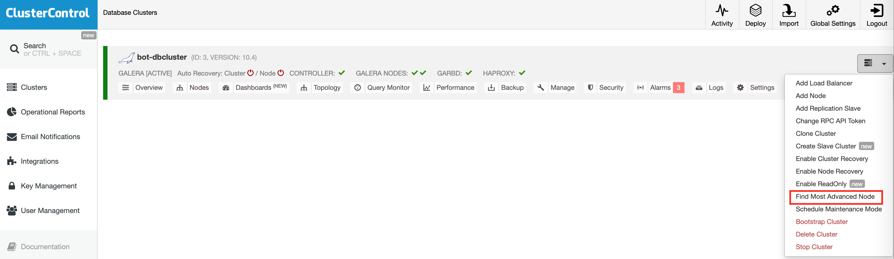

# 1. Haproxy LB

Kiểm tra file 

``` 
/etc/hosts/ 
```
 
Ping đến các địa chỉ trong file hosts

Nếu địa chỉ 10.20.0.254 không response. Kiểm tra dịch vụ keepalived.

Trên 2 máy LB kiểm tra keepalived 

```
systemctl status keepalived

```

Máy có trạng thái MASTER STATE thì sẽ giữ địa chỉ ip 10.20.0.254, trong trường hợp kiểm tra không có máy nào giữ IP 10.20.0.254, có thể restart keepalived để tự gán lại IP.

Ví dụ:

Kiểm tra máy LB2:

```
SNAPT root@halb2 ~ # systemctl status keepalived

● keepalived.service - LVS and VRRP High Availability Monitor
   Loaded: loaded (/usr/lib/systemd/system/keepalived.service; enabled; vendor preset: disabled)
   Active: active (running) since Thu 2020-11-19 14:24:26 +07; 24h ago
  Process: 1383 ExecStart=/usr/sbin/keepalived $KEEPALIVED_OPTIONS (code=exited, status=0/SUCCESS)
 Main PID: 1406 (keepalived)
    Tasks: 3 (limit: 512)
   CGroup: /system.slice/keepalived.service
           ├─1406 /usr/sbin/keepalived -D
           ├─1408 /usr/sbin/keepalived -D
           └─1409 /usr/sbin/keepalived -D

Nov 20 14:55:20 halb2 Keepalived_vrrp[1409]: VRRP_Instance(halb1) Entering BACKUP STATE
Nov 20 14:55:24 halb2 Keepalived_vrrp[1409]: VRRP_Instance(halb1) Transition to MASTER STATE
Nov 20 14:55:24 halb2 Keepalived_vrrp[1409]: VRRP_Instance(halb1) Received higher prio advert
Nov 20 14:55:24 halb2 Keepalived_vrrp[1409]: VRRP_Instance(halb1) Entering BACKUP STATE
Nov 20 14:55:28 halb2 Keepalived_vrrp[1409]: VRRP_Instance(halb1) Transition to MASTER STATE
Nov 20 14:55:28 halb2 Keepalived_vrrp[1409]: VRRP_Instance(halb1) Received higher prio advert
Nov 20 14:55:28 halb2 Keepalived_vrrp[1409]: VRRP_Instance(halb1) Entering BACKUP STATE
Nov 20 14:55:32 halb2 Keepalived_vrrp[1409]: VRRP_Instance(halb1) Transition to MASTER STATE
Nov 20 14:55:33 halb2 Keepalived_vrrp[1409]: VRRP_Instance(halb1) Received higher prio advert
Nov 20 14:55:33 halb2 Keepalived_vrrp[1409]: VRRP_Instance(halb1) Entering BACKUP STATE

```
=> Backup STATE không giữ IP 10.20.0.254

Kiểm tra máy LB1:

```
SNAPT root@halb1 ~ # systemctl status keepalived
● keepalived.service - LVS and VRRP High Availability Monitor
   Loaded: loaded (/usr/lib/systemd/system/keepalived.service; enabled; vendor preset: disabled)
   Active: active (running) since Fri 2020-11-20 14:50:58 +07; 5min ago
  Process: 1386 ExecStart=/usr/sbin/keepalived $KEEPALIVED_OPTIONS (code=exited, status=0/SUCCESS)
 Main PID: 1407 (keepalived)
    Tasks: 3 (limit: 512)
   CGroup: /system.slice/keepalived.service
           ├─1407 /usr/sbin/keepalived -D
           ├─1414 /usr/sbin/keepalived -D
           └─1416 /usr/sbin/keepalived -D

Nov 20 14:56:40 halb1 Keepalived_vrrp[1416]: VRRP_Instance(halb1) setting protocol VIPs.
Nov 20 14:56:40 halb1 Keepalived_vrrp[1416]: VRRP_Instance(halb1) Sending gratuitous ARPs on eth1 for 10.20.0.254
Nov 20 14:56:40 halb1 Keepalived_vrrp[1416]: VRRP_Instance(halb1) Sending gratuitous ARPs on eth0 for 10.20.20.10
Nov 20 14:56:40 halb1 Keepalived_healthcheckers[1414]: Netlink reflector reports IP 10.20.0.254 added
Nov 20 14:56:40 halb1 Keepalived_healthcheckers[1414]: Netlink reflector reports IP 10.20.20.10 added
Nov 20 14:56:40 halb1 Keepalived_vrrp[1416]: VRRP_Instance(halb1) Received lower prio advert in nopreempt mode
Nov 20 14:56:40 halb1 Keepalived_vrrp[1416]: VRRP_Instance(halb1) Entering BACKUP STATE
Nov 20 14:56:40 halb1 Keepalived_vrrp[1416]: VRRP_Instance(halb1) removing protocol VIPs.
Nov 20 14:56:40 halb1 Keepalived_healthcheckers[1414]: Netlink reflector reports IP 10.20.0.254 removed
Nov 20 14:56:40 halb1 Keepalived_healthcheckers[1414]: Netlink reflector reports IP 10.20.20.10 removed

```

=> BACKUP STATE, bị xoá IP 10.20.0.254


Khi đó có thể restart keepalived 1 trong 2 máy.

```
systemctl restart keepalived

```

Kiểm tra lại trạng thái máy còn lại

```
SNAPT root@halb2 ~ # systemctl status keepalived
● keepalived.service - LVS and VRRP High Availability Monitor
   Loaded: loaded (/usr/lib/systemd/system/keepalived.service; enabled; vendor preset: disabled)
   Active: active (running) since Thu 2020-11-19 14:24:26 +07; 24h ago
  Process: 1383 ExecStart=/usr/sbin/keepalived $KEEPALIVED_OPTIONS (code=exited, status=0/SUCCESS)
 Main PID: 1406 (keepalived)
    Tasks: 3 (limit: 512)
   CGroup: /system.slice/keepalived.service
           ├─1406 /usr/sbin/keepalived -D
           ├─1408 /usr/sbin/keepalived -D
           └─1409 /usr/sbin/keepalived -D

Nov 20 14:58:39 halb2 Keepalived_vrrp[1409]: VRRP_Instance(halb1) Entering BACKUP STATE
Nov 20 14:58:42 halb2 Keepalived_vrrp[1409]: VRRP_Instance(halb1) Transition to MASTER STATE
Nov 20 14:58:43 halb2 Keepalived_vrrp[1409]: VRRP_Instance(halb1) Entering MASTER STATE
Nov 20 14:58:43 halb2 Keepalived_vrrp[1409]: VRRP_Instance(halb1) setting protocol VIPs.
Nov 20 14:58:43 halb2 Keepalived_vrrp[1409]: VRRP_Instance(halb1) Sending gratuitous ARPs on eth1 for 10.20.0.254
Nov 20 14:58:43 halb2 Keepalived_vrrp[1409]: VRRP_Instance(halb1) Sending gratuitous ARPs on eth0 for 10.20.20.10
Nov 20 14:58:43 halb2 Keepalived_healthcheckers[1408]: Netlink reflector reports IP 10.20.0.254 added
Nov 20 14:58:43 halb2 Keepalived_healthcheckers[1408]: Netlink reflector reports IP 10.20.20.10 added
Nov 20 14:58:48 halb2 Keepalived_vrrp[1409]: VRRP_Instance(halb1) Sending gratuitous ARPs on eth1 for 10.20.0.254
Nov 20 14:58:48 halb2 Keepalived_vrrp[1409]: VRRP_Instance(halb1) Sending gratuitous ARPs on eth0 for 10.20.20.10
```

=> Đã được add 10.20.0.254

Kiểm tra lại ip

```
ip r
```

```
ping 10.20.0.254
```
 
 Tham khảo tài liệu:
 
[ Hướng dẫn kết nối kiểm tra HAPROXY - Loadbanlancer](https://git.linex.vn/LiNEX/vvg-bot/src/branch/master/guide/10.%20Haproxy_LB_notes.md)

# 2. Database + Cluster
Truy cập máy cluster, kiểm tra database nếu có lỗi

**Fix lỗi Cluster database**

Trên giao diện cluster control, Chọn find most advanced node (Tìm node có dữ liệu mới nhất)



Sau khi chạy xong, cho kết quả node có dữ liệu mới nhất


ssh vào máy mariadb 1 và 2


Kiểm tra tiến trình mysql

```
ps -ef | grep mysql

mysql    14633     1  1 16:36 ?        00:00:03 /usr/sbin/mysqld --wsrep-new-cluster --wsre
p_start_position=ee38e9a9-1f45-11eb-8ba5-7683e606da08:455
root     26402 26383  0 16:40 pts/8    00:00:00 mysql
root     31018 30114  0 16:41 pts/9    00:00:00 grep --color=auto mysql

```

Force quit tiến trình mysql đang chạy

```
kill -9 14633
```

Kiểm tra lại  tiến trình mysql chắc chắn không còn chạy

```
ps -ef | grep mysql


root     26402 26383  0 16:40 pts/8    00:00:00 mysql
root     31018 30114  0 16:41 pts/9    00:00:00 grep --color=auto mysql

```

Thực hiện tương tự với máy mariadb2

Sau đó trên giao diện, thực hiện boostrap node có dữ liệu mới nhất


Nếu thực hiện boostrap node mà bị dừng ở máy db nào thì ta force quit tiến trình mysql trong máy đó.

Hoàn thành recovery cluster, start node garbd nếu cần. Nếu node garbd & HA không start được -> Kiểm tra lại ip 10.20.0.254, xem lại mục 1. Haproxy LB


# 3. Hướng dẫn mở port Firewall từ Loadbalancer (Halb1 - Halb2)

Trong trường hợp có thay đổi về port trên máy app ->  cần mở port tại máy halb1 / halb2 để forward ra ngoài, thực hiện như sau:

- Trên máy halb gõ lệnh

```
yast firewall
```


1. Chọn Masquerading
2. Add thêm rule mới
3. Thêm nội dung rule:

Source Network: 0/0
Protocol: Chọn tcp hoặc http/udp.. tuỳ theo nhu cầu
Reg. Port: Port mở tại máy halb
Redir. to IP: Forward đến IP nào
Redir. to Port: Port được mở trên máy cần portward

Ví dụ: 
```
 │ ││Source Network│Protocol│Req. IP│Req. Port        │  │Redir. to IP│Redir. to Port 
 │ ││0/0           │tcp     │       │ipcore (2215)    │=>│10.20.0.15  │ssh (22)       
```

Giải thích: Mọi truy cập TCP đến máy hiện tại (HALB) tới port 2215 sẽ được portward sang máy 10.20.0.15 port 22 (SSH)

Tức khi muốn truy cập ssh tới máy app1 thông qua mạng public (theo mô hình) sẽ đi qua máy HALB với ip floating 10.248.189.100 port 2215.

Thực hiện tương tự với các máy còn lại.

# 4. Hướng dẫn đổi lại domain trên HAPROXY khi triển khai trạm khác

Tại file cấu hình HAPROXY bên trên có ID trạm là 5030 => domain sử dụng có dạng mtc-5030.boo2.vn...

Trước khi thực hiện thay đổi file cấu hình cần tạo 1 bản backup

```
cd /etc/haproxy/

```

```
SNAPT root@halb1 /etc/haproxy # ll
total 12
-rw-r--r-- 1 root   root   4032 Nov 30 11:15 certs.list
-rwxrwxrwx 1 nobody nobody 6531 Nov 28 19:30 haproxy.cfg
```

```
SNAPT root@halb1 /etc/haproxy # cp haproxy.cfg haproxy.cfg.bak

SNAPT root@halb1 /etc/haproxy # ll
total 20
-rw-r--r-- 1 root   root   4032 Nov 30 11:15 certs.list
-rwxrwxrwx 1 nobody nobody 6531 Nov 28 19:30 haproxy.cfg
-rwxr-xr-x 1 root   root   6531 Nov 30 12:08 haproxy.cfg.bak

```

Tiếp tục sửa như sau:

Tìm và sửa 5030 thành id mới của trạm tại file haproxy.cfg

```
perl -pi -e 's|5030|id-moi-cua-tram|g' haproxy.cfg
```

Sau khi sửa file xong vào kiểm tra lại nội dung file.

Sau đó test file config.

```
    haproxy -c -f /etc/haproxy/haproxy.cfg
```

Reload lại haproxy

```
rchaproxy reload
```
