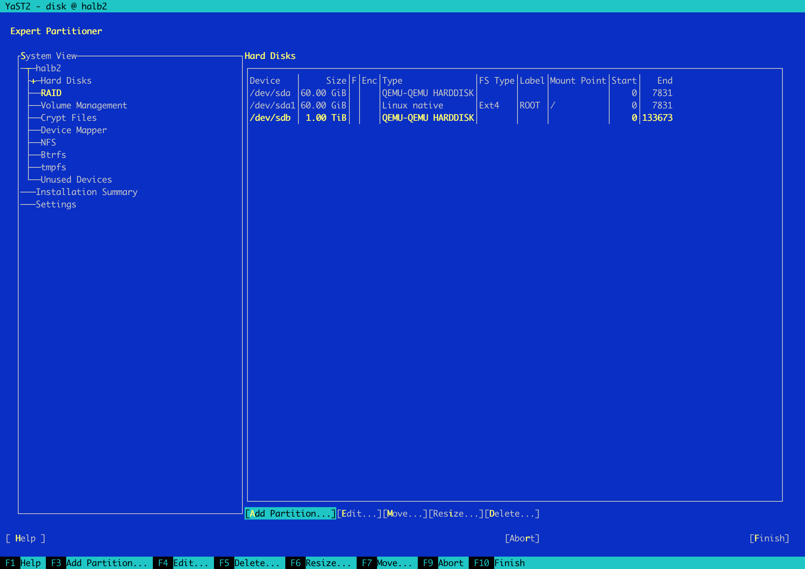
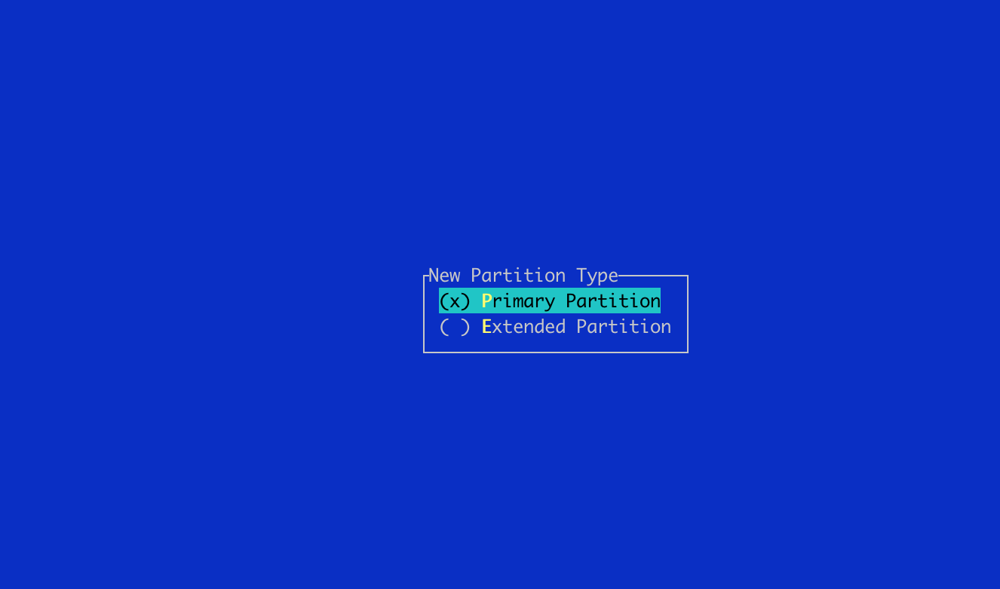
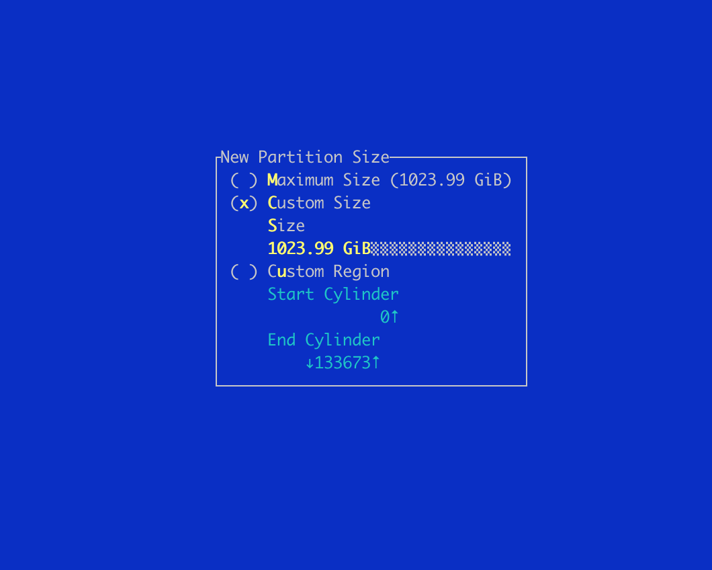
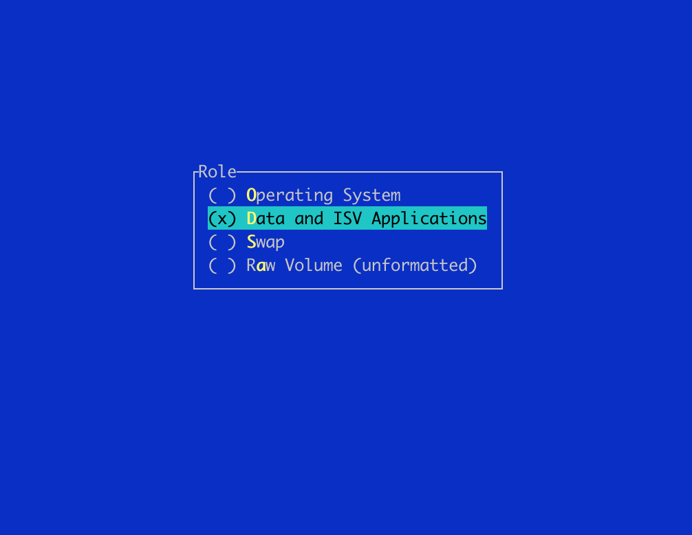
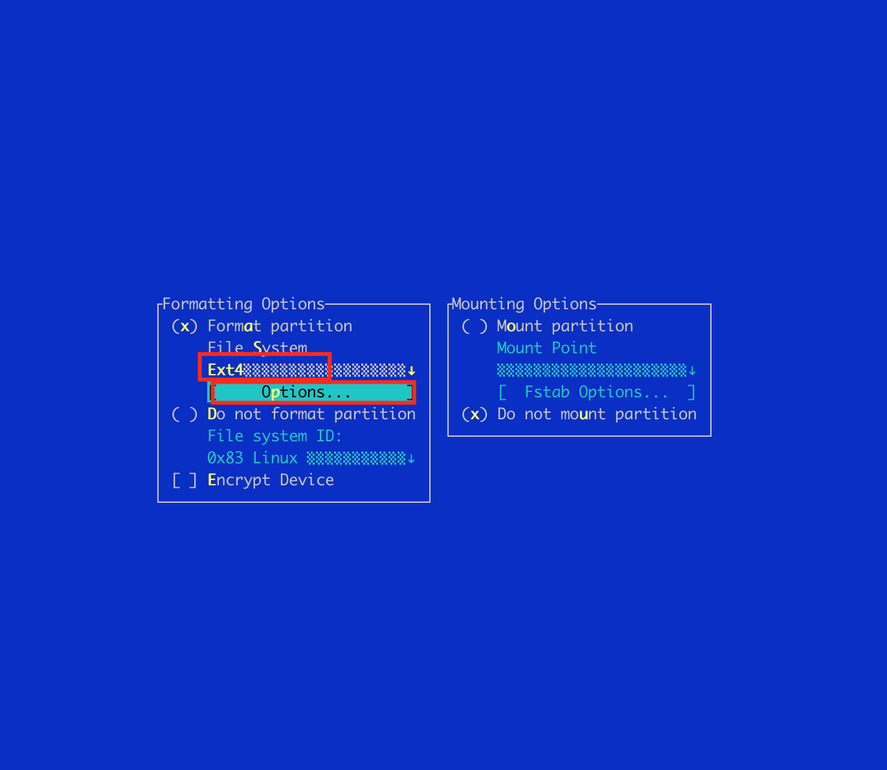
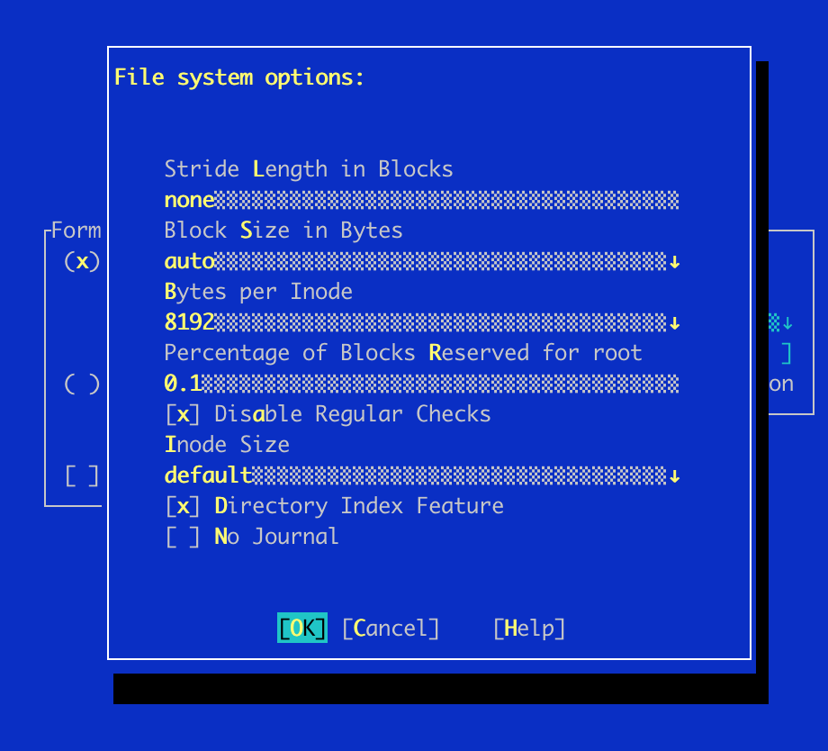
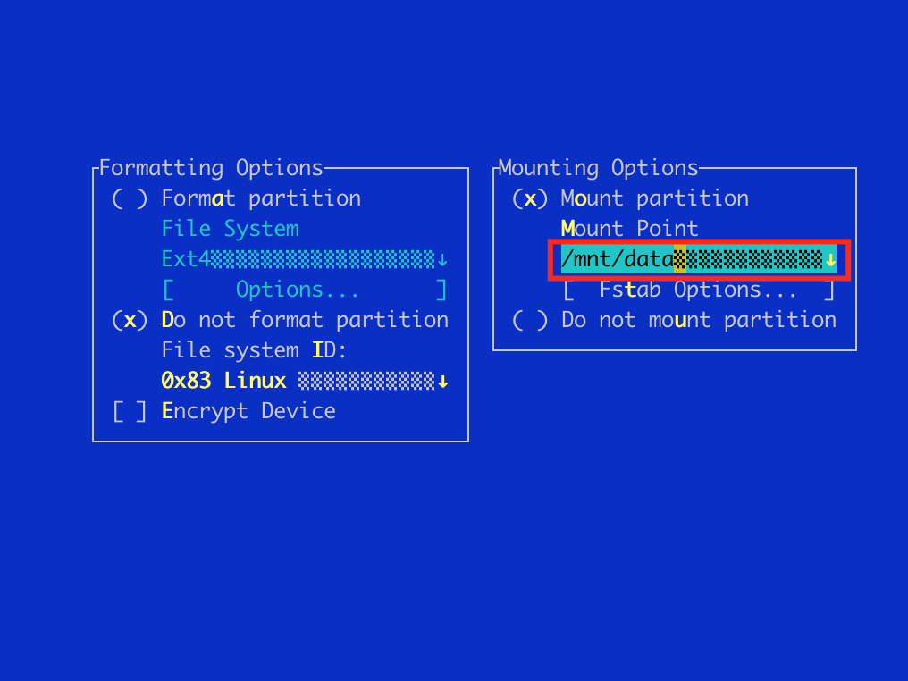
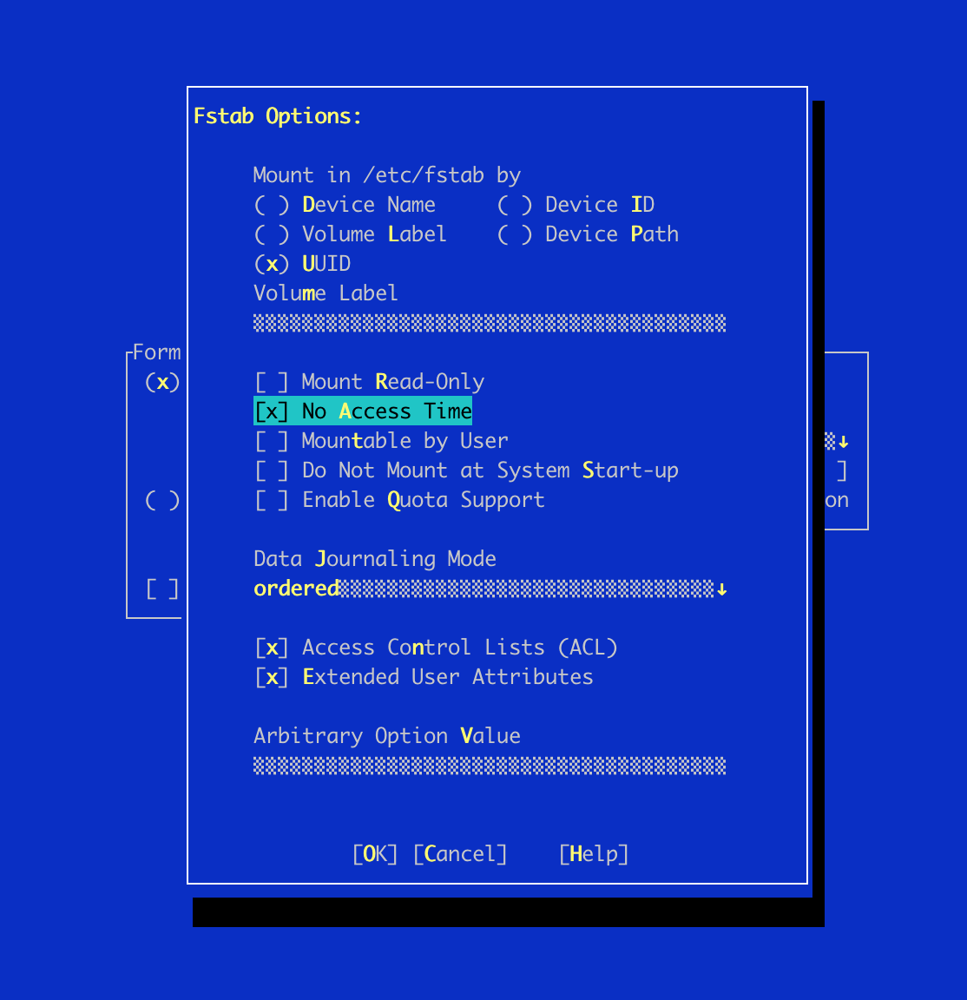

# Note SMB mount

VVG: SMB note

## 1. Mount phân vùng /mnt/data trên cả 2 máy lb1 và lb2

- Tắt máy
- Thêm ổ đĩa trên HALB1 và HALB2 dung lượng 1 TB lưu trữ ảnh từ app.
- Bật máy
- Truy cập vào kiểm tra đĩa

```
lsblk

NAME   MAJ:MIN RM  SIZE RO TYPE MOUNTPOINT
sda      8:0    0   60G  0 disk
└─sda1   8:1    0   60G  0 part /
sdb      8:16   0    1T  0 disk
sr0     11:0    1    4M  0 rom
```

Format sdb dạng Ext4 như sau:

gõ lệnh yast disk vào quản lý ổ đĩa

```
yast disk
```

Chọn sdb phân vùng cần tạo thêm partition

Add partition










Chọn EXT4 và option như sau




Chọn số 8192 tại Bytes per Inodes



Mount tại /mnt/data



Chọn option No Access Time




Sau khi tạo xong partition kiểm tra lại

```
lsblk

NAME   MAJ:MIN RM  SIZE RO TYPE MOUNTPOINT
sda      8:0    0   60G  0 disk
└─sda1   8:1    0   60G  0 part /
sdb      8:16   0    1T  0 disk
└─sdb1   8:17   0 1024G  0 part /mnt/data
sr0     11:0    1    4M  0 rom
```

Đã thấy mount /mnt/data

Kiểm tra lại inode trên phân vùng vừa tạo


```
dumpe2fs -h /dev/sdb1

Inode count:              134217728
Block count:              268435200
```

Phân quyền cho thư mục data

```
cd /mnt

chmod 777 data
```

Add repo cài đặt samba

```
vi /etc/zypp/repos.d/openSuSE-Leap-42.3.repo


[openSuSE-Leap-42.3]
name=openSuSE-Leap-42.3
enabled=1
autorefresh=1
baseurl=http://ftp.gwdg.de/pub/opensuse/discontinued/distribution/leap/42.3/repo/oss/
path=/
type=yast2
keeppackages=0
```


Cài đặt samba

```
zypper install samba
```

File cấu hình samba


```
vi /etc/samba/smb.conf

# smb.conf is the main Samba configuration file. You find a full commented
# version at /usr/share/doc/packages/samba/examples/smb.conf.SUSE if the
# samba-doc package is installed.
[global]
	workgroup = boo2vn
	passdb backend = tdbsam
	printing = cups
	printcap name = cups
	printcap cache time = 750
	cups options = raw
	map to guest = Bad User
	include = /etc/samba/dhcp.conf
	logon path = \\%L\profiles\.msprofile
	logon home = \\%L\%U\.9xprofile
	logon drive = P:
	usershare allow guests = No
	add machine script = /usr/sbin/useradd  -c Machine -d /var/lib/nobody -s /bin/false %m$
	domain logons = No
	domain master = No
	security = user
	wins support = No
	wins server =
[homes]
	comment = Home Directories
	valid users = %S, %D%w%S
	browseable = No
	read only = No
	inherit acls = Yes
[profiles]
	comment = Network Profiles Service
	path = %H
	read only = No
	store dos attributes = Yes
	create mask = 0600
	directory mask = 0700
[users]
	comment = All users
	path = /home
	read only = No
	inherit acls = Yes
	veto files = /aquota.user/groups/shares/
[groups]
	comment = All groups
	path = /home/groups
	read only = No
	inherit acls = Yes

## Share disabled by YaST
# [printers]
#	comment = All Printers
#	path = /var/tmp
#	printable = Yes
#	create mask = 0600
#	browseable = No
[print$]
	comment = Printer Drivers
	path = /var/lib/samba/drivers
	write list = @ntadmin root
	force group = ntadmin
	create mask = 0664
	directory mask = 0775

[data]
	guest ok = Yes
	inherit acls = Yes
	path = /mnt/data
	read only = No

## Share disabled by YaST
# [netlogon]

```

Start service samba

```
    systemctl start smb
    
```


Kiểm tra trạng thái service smb

```
SNAPT root@halb1 ~ # systemctl status smb
● smb.service - Samba SMB Daemon
   Loaded: loaded (/usr/lib/systemd/system/smb.service; enabled; vendor preset: disabled)
   Active: active (running) since Mon 2020-12-28 11:42:39 +07; 2h 49min ago
 Main PID: 5848 (smbd)
   Status: "smbd: ready to serve connections..."
    Tasks: 4 (limit: 512)
   CGroup: /system.slice/smb.service
           ├─5848 /usr/sbin/smbd --foreground --no-process-group
           ├─5851 /usr/sbin/smbd --foreground --no-process-group
           ├─5852 /usr/sbin/smbd --foreground --no-process-group
           └─5858 /usr/sbin/smbd --foreground --no-process-group

Dec 28 11:42:39 halb1 systemd[1]: Stopped Samba SMB Daemon.
Dec 28 11:42:39 halb1 systemd[1]: Starting Samba SMB Daemon...
Dec 28 11:42:39 halb1 smbd[5848]: [2020/12/28 11:42:39.545178,  0] ../lib/util/become_daemon.c:124(daemon_ready)
Dec 28 11:42:39 halb1 systemd[1]: Started Samba SMB Daemon.
Dec 28 11:42:39 halb1 smbd[5848]:   STATUS=daemon 'smbd' finished starting up and ready to serve connections
```

Có thể sử dụng yast samba-server để cấu hình samba.

## 2. Sửa file lsync để sync /mnt/data trên halb1 và halb2

Tại Lb1 thêm nội dung vào cuối file /etc/lsyncd/lsyncd.conf

```
--##/mnt/data
sync {
    default.rsync,
    delete = false,
    delay = 4,
    source="/mnt/data",
    target="halb2:/mnt/data",
    rsync = {
        compress = true,
        owner = true,
        group = true,
        acls = true,
        verbose = true,
        update = true,
        rsh = "/usr/bin/ssh -i /root/.ssh/id_rsa -o StrictHostKeyChecking=no"
    },
}
```

thêm vào lb2


```
--##/mnt/data
sync {
    default.rsync,
    delete = false,
    delay = 6,
    source="/mnt/data",
    target="halb1:/mnt/data",
    rsync = {
        compress = true,
        owner = true,
        group = true,
        acls = true,
        verbose = true,
        update = true,
        rsh = "/usr/bin/ssh -i /root/.ssh/id_rsa -o StrictHostKeyChecking=no"
    },
}
```

Chú ý thời gian delay và target.

Sau đó restart lại lsync và kiểm tra service


```
systemctl restart lsyncd

systemctl status lsyncd

```


## 3. Map network trên máy app (windows)


Trong máy ap1, ap2, các máy tại làn, tạo file C:\app\mapzdrive.bat nội dung như sau:

```
@echo off
net use z: \\10.248.185.100\data /persistent:yes
set SNAME=map-z-drive
echo "installing %SNAME% service"
nssm install %SNAME% "C:\app\mapzdrive.bat"
nssm set %SNAME% AppDirectory C:\app\
nssm set %SNAME% AppStdout C:\app\%SNAME%.log
nssm set %SNAME% AppStderr C:\app\%SNAME%.log
nssm set %SNAME% AppRotateFiles 1
nssm set %SNAME% AppRotateBytes 4096000
```

Khởi động service map-z-drive auto chạy cùng windows.

