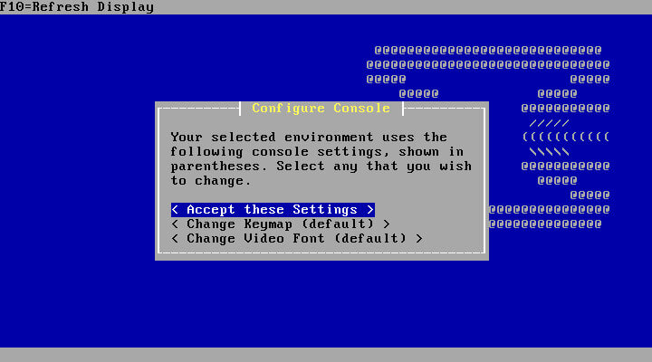

## Cài đặt và cấu hình opnsense

#### 1. Cài đặt máy ảo

Sau khi cài, bật máy ảo hiển thị giao diện boot như sau:

Để tiếp tục đến trình cài đặt, chỉ cần nhấn phím ‘Enter’. Thao tác này sẽ khởi động OpnSense vào chế độ livemode nhưng có một người dùng đặc biệt để cài đặt OpnSense vào ổ cứng.

Khi hệ thống khởi động đến lời nhắc đăng nhập, hãy sử dụng tên người dùng của '**installer**' với mật khẩu là '**opnsense**'.

Hiển thị giao diện cài đặt 

Nhấn phím ‘Enter’ sẽ bắt đầu quá trình cài đặt. Bước đầu tiên là chọn sơ đồ bàn phím. Trình cài đặt có thể sẽ phát hiện sơ đồ bàn phím thích hợp theo mặc định. 

Màn hình tiếp theo sẽ cung cấp một số tùy chọn để cài đặt. Nếu người dùng muốn chia phân vùng hoặc nhập cấu hình từ một OpnSense khác có sẵn. Hướng dẫn này giả định một cài đặt mới và sẽ chọn tùy chọn 'Guided Installation'.

Màn hình sau sẽ hiển thị các thiết bị lưu trữ được thấy có thể sử dụng để cài đặt.

Lựa chọn GPT/EFI 

Tiến trình cài đặt đang chạy như sau

Cài đặt mật khẩu cho root

Sau khi hoàn thành hiển thị giao diện đăng nhập

Sau khi cài đặt xong ip opnsense nhận là 192.168.1.1

Sau khi đăng nhập, chọn **2 Set Interface IP Address** để đặt ip mới cho opnsense: 10.20.20.4, subnetmask: 24. No enable DCHP Server for LAN network. 

Truy cập giao diện: https://10.20.20.4

Hiển thị giao diện cấu hình cơ bản:

Điền thông tin như dưới đây, bỏ chọn Override DNS

Cài đặt TimeZone

Đặt địa chỉ ip tĩnh cho mạng phía ngoài (kết nối modem/internet hoặc LAN cũ đang sử dụng)

Đặt IP cho LAN bên trong hệ thống

Đặt lại PASSWORD cho ROOT, next nếu bỏ qua

Chuyển sang Phần ** Setting -> Administrator **

Lựa chọn giao thức https và đặt port 9443 cho opnsense

Cho phép SSH root vào server

Hoàn thành cài đặt cơ bản

Tiến hành update firmware và cài đặt plugin HAPROXY

Chọn tab plugin + install HAPROXY

Sau đó reload lại giao diện, HAPROXY sẽ hiển thị ở mục Services

REF: https://docs.opnsense.org/manual/how-tos/haproxy.html